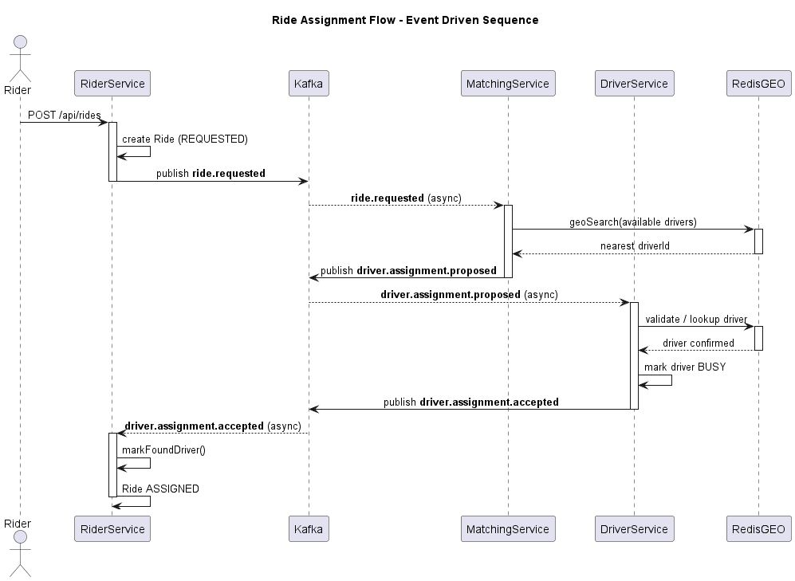
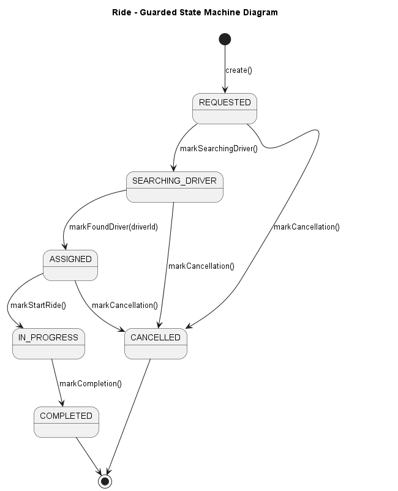
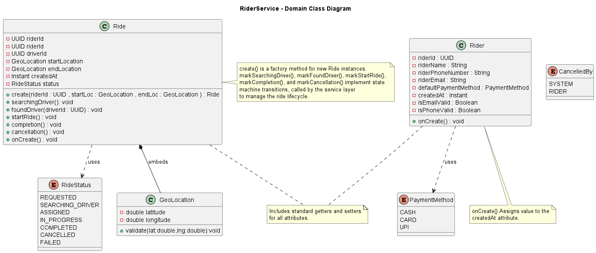
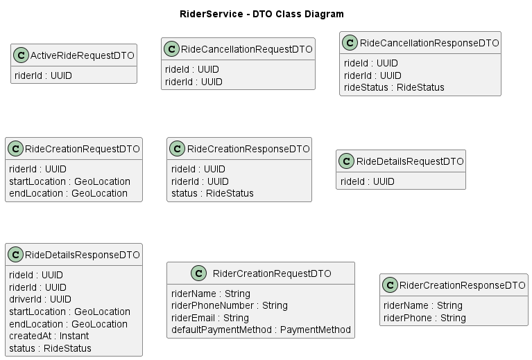
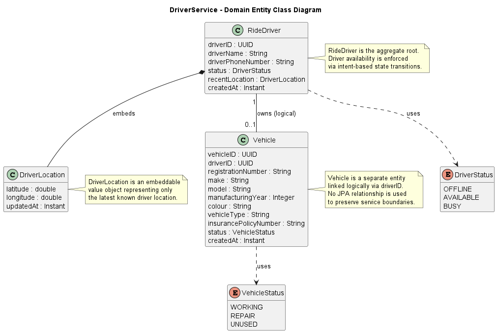
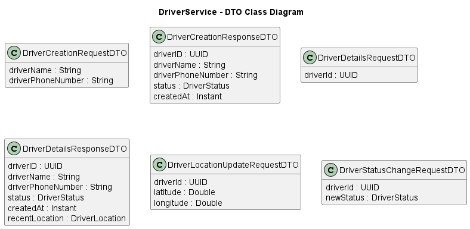
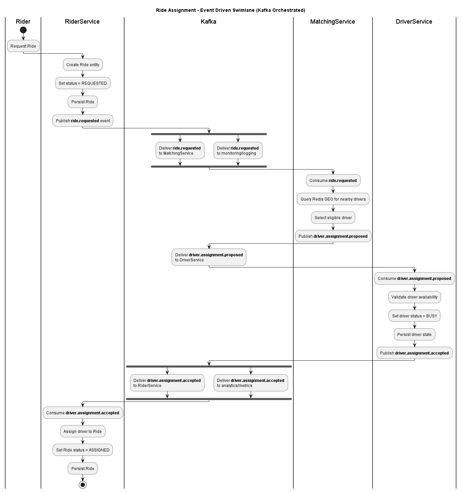

# PullUp 
PullUp is an educational backend prototype inspired by Uber’s large scale event driven architecture.  
It explores real system design concepts such as domain driven design, state machines, Kafka based coordination, Redis geospatial indexing and eventual consistency while deliberately avoiding CRUD centric or synchronous designs.

## Disclaimer

Disclaimer PullUp is an educational prototype inspired by Uber’s backend architecture.  
It is not affiliated with endorsed by or representative of Uber Technologies Inc.  
All trademarks names and references to Uber belong to their respective owners.

## Project Gist

This project models a ride hailing backend where rides and drivers are independent state machines and services communicate only through events. Redis is used strictly as a derived performance index and Kafka acts as the coordination backbone.

The goal is not feature completeness but architectural correctness and learning through real failure modes.

## Motivation

PullUp intentionally avoids synchronous REST calls between services shared databases and CRUD driven domain models.

This project was built to  
- Model business workflows using explicit state machines  
- Use Kafka for coordination not RPC  
- Treat Redis as derived state never a source of truth  
- Embrace eventual consistency and failure aware design  
- Experience and document real distributed systems pitfalls

## High Level Architecture

The system consists of independently owned microservices each with clear responsibilities

### RiderService
Owns the ride lifecycle and ride state machine

### DriverService
Owns driver lifecycle availability and location

### MatchingService
Stateless coordination service responsible for driver selection

### Apache Kafka
Event backbone for all inter service communication

### Redis
Geospatial index of available drivers derived state only

- All communication is asynchronous.  
- No service makes synchronous calls to another service.  
- No databases are shared.

## Core Event Flow

1. Rider creates a ride publishes ride.requested  
2. MatchingService queries Redis GEO index for nearby drivers  
3. MatchingService publishes driver.assignment.proposed  
4. DriverService accepts or rejects based on driver state  
5. RiderService updates ride state upon acceptance  

### Sequence Diagram

---

## State Machines

### Ride State Machine
REQUESTED → SEARCHING_DRIVER → ASSIGNED → IN_PROGRESS → COMPLETED or CANCELLED

### Driver State Machine
OFFLINE → AVAILABLE → BUSY → AVAILABLE

State transitions are enforced via intent based methods.  
Entities expose no public setters ensuring domain invariants remain intact.

### Ride State Machine Diagram

---

## Domain Models and DTOs

The domain model is explicitly separated from external facing DTOs to prevent leakage of internal state and invariants.

### Rider Service

#### Entity Model

---

#### DTO Model

---

### Driver Service

#### Entity Model

---
#### DTO Model

---

## Service Interaction View

A swimlane diagram is used to visualize responsibility boundaries across services and the flow of events between them.

### Swimlane Diagram

---

## Redis Design

Redis is used strictly as a derived non authoritative data store.

- Key drivers:available  
- Type GEO sorted set  
- Updated via events driver.location.updated and driver.status.changed  
- Queried by MatchingService only  

Redis never owns correctness it enables fast lookup not enforcement.

## Kafka and Event Design

- Explicit JSON contracts  
- Events contain only facts known at emit time  
- UUIDs used consistently  
- At least once delivery semantics  
- No distributed transactions  
- No shared event modules across services  

Kafka is treated as a coordination log not a message queue.

## Technology Stack

### Core Backend Technologies

### Messaging and Streaming

### Databases and Storage

### Containerization and Runtime

### Architecture and Design

## Known Issues and Learnings

This project intentionally documents real development pitfalls.

- Early messages were produced with Kafka type headers which caused deserialization issues during contract evolution  
- Kafka message immutability requires topic hygiene and versioning  
- Redis derived state can temporarily diverge from database state  
- Consumer group offsets strongly affect replay behavior  

In a production system these would be addressed using topic versioning DLQs retention policies and schema governance.

## Current Debugging Work

- Cleaning historical Kafka messages with legacy type headers  
- Improving consumer error isolation  

## Future Enhancements

- WebSocket server for real time ride and driver heartbeat delivery  
- QUIC and HTTP 3 exploration for low latency UDP based communication  

- Observability : Prometheus metrics , Grafana dashboards , Kafka consumer lag monitoring  

- Infrastructure : Kubernetes orchestration , Spring Cloud features , Centralized configuration management  

These features can be layered without changing core domain logic.

## Final Note

PullUp is intentionally incomplete.

Its value lies not in feature parity but in architectural decisions explicit trade offs and lessons learned while building real distributed systems.
